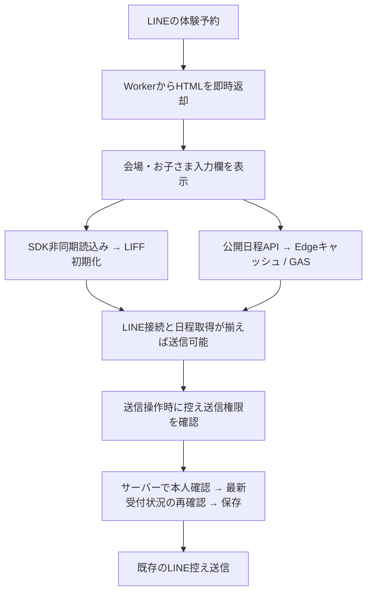

# 体験予約の起動高速化・安定化（2026-09-13）

対象は `prospect-line-webhook` の `/reserve` と公開日程取得です。会場ルート、予約保存時のLINE本人確認、クラス・日程の再確認、Webhook、活動申込 `/apply` は既存の境界を維持します。

## 確認した待ち時間の構造

調査元は main `e7ce643c0a0841b57c3d570fce84ca8400b5e771`。利用者が報告した「通常6秒、10秒超・エラー」は実機で再計測していません。コードからは次の待ち時間の加算を確認しました。

1. head内の同期SDK読込みがHTML解析を止める。
2. LIFF初期化を待つ（最初の上限25秒、実際の失敗後に再試行あり）。
3. トークへの控え送信権限を最大12秒待つ。
4. GASの日程取得を待つ。Workerの各試行は30秒・18秒・12秒、ブラウザ側は55秒。古い生成時刻からの再確認は別の再試行経路になる。
5. 全処理が成功してからフォームを表示。どれか失敗するとフォームを隠す。

したがって「LINE接続中」という表示には、認証以外の待ち時間も混在していました。各段階が何秒を占めたかは本番計測が必要です。

## 実装した構成

- フォーム表示は認証・権限照会・GAS取得を待たない。送信はLINE接続と有効な受付情報の両方が揃うまで無効。
- LIFFと日程取得を並行開始。控え送信権限の確認は送信操作時へ移動し、保存前と控え送信前の検証は維持。
- 接続・日程を別々に表示し、完了した表示は消す。失敗した処理のみボタンで再試行。日程の再取得でLINE初期化をやり直さない。
- SDK/LIFF初期化は、実行中の処理がある間は増やさない。12秒経過で遅延案内を出す。遅れて成功した場合もそのまま復旧。処理自体が失敗した場合は再試行できる。応答が永久に返らないLINE側処理は画面から安全にキャンセルできないため、案内に従いLINEから開き直す。
- `liff.state`・クエリ・パスから会場を読み取る。初期化前にURLを書き換えない。一次リダイレクトで会場がまだ取れなくてもLIFF初期化を実行する。
- 同じ画面での再試行は入力を保持。LIFF自身によるページ切替の際は、未送信の入力だけを会場別にsessionStorageへ退避し、30分以内に同じタブで再表示した場合のみ復元する。復元後は削除。トークン・受付番号は保存しない。保存APIを試行した後の入力はページをまたいで自動復元しない。
- GAS公開日程読取りは合計8秒以内。再試行・HTTP本文取得・生成時刻が古い場合の再確認も同じ期限内。タイムアウトしたGAS実行には自動再試行を重ねない。ブラウザ側は10秒で中断し、入力を残して再取得を案内する。
- Edgeキャッシュの3分fresh・1時間stale・障害時24時間の既存条件を維持。生成時刻の更新偽装、期限切れ値での確定、閉鎖クラスの受付は許可しない。
- キャッシュの読書きが失敗しても正常なGAS結果は返す。キャッシュ保存は可能なら応答後に行う。内部キャッシュ用の24時間TTLを公開POST応答へ流用せず、`no-store`にする。
- 送信の二重操作を抑止。同一内容の再確認で使用する既存requestIdの扱いを維持する。

## 性能目標と計測

目標値は未測定の受入基準であり、実測結果ではありません。

| 指標 | 目標 / 判定 |
|---|---|
| 最終LIFFエンドポイントのnavigation開始 → 入力可能 | 通常回線でp95 1秒以内 |
| 同navigation開始 → 送信可能 | Edgeキャッシュhit時p95 3秒以内を目標に実機測定 |
| GASの応答停止 | 約8秒の読取り期限で終了。フォームを残して再取得を案内 |
| LIFFの応答遅延 | 12秒で案内。二重初期化せず、遅れた成功を反映 |
| LINEのボタンを押してからの総時間 | 上記とは別に画面録画で測定。LINE側のリダイレクト時間も含める |

ブラウザのPerformance marks: `reservation:form-visible`, `sdk-ready`, `line-initialized`, `line-ready`, `availability-ready`。日程APIは `Server-Timing: availability;dur=...` と `X-Prospect-Cache` を返す。URLや認証情報を外部ログへ送らない。これらは計測点であり、自動集計基盤は追加していない。

キャッシュのない会場・拠点では引き続きGASを読むため、GAS応答自体の高速化や8秒を超える障害の解消を保証する変更ではありません。これが実機測定で主因として残る場合は、次段階で公開日程の永続スナップショットをCloudflare側へ事前同期し、初回アクセスからGAS読取りを外します。Cloudflare Cache APIは拠点間で共有される永続保存ではないため、単にTTLを延ばす方法では代替できません。

## 検証と切替

- `node --check src/index.js`、`npm test`。既存15件にDOMを使った起動・再試行・入力保持・期限・キャッシュ故障テストを追加。
- CIで `npm ci --ignore-scripts` → 構文検証 → テスト → `npm run check`（Wrangler dry-run）を行う。
- テストはダミーのLINE SDK・GAS応答を使う。実際の予約やLINEメッセージは送信しない。
- ローカルWindowsでのWrangler dry-runは親ディレクトリのアクセス制限で失敗したため、Linux CIの結果を切替判定に使う。
- 本番反映前に現行Worker version、Binding名、LIFF endpoint設定を読み取り、復元先を記録する。秘密値は記録しない。LIFF ID/endpointやGASの変更は今回不要。
- `REPAIR-P06.md` の最終オーナー承認条件と、mainへのマージで自動配信される構成を踏まえ、今回はドラフトPRまでとする。承認後に対象Workerだけを反映し、healthのbuild一致と30会場の日程読み取りを確認する。
- iPhone/AndroidのLINE内で初回・再訪、低速回線、圏外から復帰、権限不足、閉鎖・キャンセル待ちを確認する。実予約・実メッセージを使う検証は別途明示された範囲で行う。
- 問題があれば記録したWorker versionへ戻す。DB・Binding・GASの変更がないため、コードの復元で戻せる。古いHTMLのブラウザキャッシュが最大5分残る可能性を切替時に考慮する。

## 設計根拠

- [LINE公式: LIFFアプリの開発](https://developers.line.biz/en/docs/liff/developing-liff-apps/): 初期化タイミング、一次・二次リダイレクト、初期化前のURL変更禁止。
- [LINE公式: LIFF API](https://developers.line.biz/en/reference/liff/): 初期化Promiseと権限APIの役割。
- [Cloudflare公式: Cache API](https://developers.cloudflare.com/workers/runtime-apis/cache/): 拠点ごとのキャッシュ特性。
- [Cloudflare公式: Workers best practices](https://developers.cloudflare.com/workers/best-practices/workers-best-practices/): 応答後の処理と外部依存の分離。
